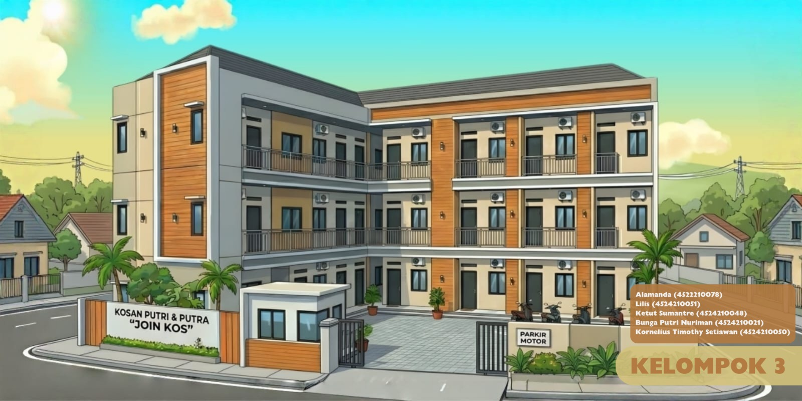

# LAPORAN-TUGAS-APBO-SISTEM-INFORMASI-MANAJEMEN-KOS

## Anggota Kelompok 3

| Nama | NPM |
| :--- | :--- |
| Alamanda | 4522210078 |
| Lilis | 4524210051 |
| Ketut Sumantre | 4524210048 |
| Bunga Putri Nuriman | 4524210021 |
| Kornelius Timothy Setiawan | 4524210050 |

---

# Sasaran Pengguna
### [Peran Pengguna 1, misal: Admin/Pengelola]
### [Peran Pengguna 2, misal: User/Pelanggan]

---

# Studi Literatur
### 1. [Topik Literatur 1]
### 2. [Topik Literatur 2]
### 3. [Topik Literatur 3]

---

# Hasil Wawancara: Sistem Informasi Manajemen Kos

Klik pada masing-masing bagian di bawah ini untuk melihat detail daftar pertanyaan dan jawaban hasil wawancara terkait sistem yang sedang berjalan:

<b>Bagian 1: Operasional & Manajemen Inventaris Kamar</b>

1. **Bagaimana sistem pengelolaan kos saat ini berjalan?**
   > "Saat ini masih sepenuhnya manual, hanya mengandalkan WhatsApp untuk komunikasi dan buku tulis untuk pencatatan."

2. **Berapa jumlah kamar dan penghuni kos saat ini?**
   > "Total tersedia 20 kamar. Saat ini terisi 18 kamar dengan total penghuni sebanyak 18 orang."

3. **Apa saja kendala utama yang sering dihadapi dalam mengurus operasional kos?**
   > "Kendala utama adalah manajemen penagihan biaya bulanan dan menangani keluhan fasilitas. Karena faktor usia, pengelola sering kali lupa terhadap detail keluhan yang masuk."

4. **Bagaimana cara menyimpan dan mengelola data fisik penghuni?**
   > "Data disimpan dalam map fisik yang berisi fotokopi KTP dan Kartu Keluarga."

5. **Apakah pernah mengalami kesulitan atau kehilangan data penghuni?**
   > "Sering kesulitan mencari data karena tercampur dalam satu map dokumen. Bahkan pernah terjadi kehilangan data karena pengelola lupa tempat menyimpannya."

<b>Bagian 2: Alur Pembayaran & Keuangan</b>

1. **Bagaimana proses pembayaran kos dilakukan oleh penghuni?**
   > "Sebagian besar melalui transfer manual ke rekening bank atau GoPay, namun masih ada beberapa penghuni yang membayar secara tunai (cash)."

2. **Bagaimana metode pencatatan pembayaran yang digunakan?**
   > "Untuk transfer, penghuni mengirimkan bukti *screenshot* via WhatsApp, lalu saya catat manual di buku. Pembayaran tunai juga langsung dicatat di buku yang sama."

3. **Bagaimana cara Anda memantau status pembayaran setiap bulannya?**
   > "Saya harus mengecek buku catatan satu per satu dan mencocokkannya dengan mutasi di m-banking atau aplikasi GoPay untuk memastikan siapa yang belum bayar."

4. **Apakah sering terjadi keterlambatan pembayaran? Apa alasannya?**
   > "Lumayan sering, sekitar 3 sampai 4 orang setiap bulannya. Alasannya beragam, mulai dari menunggu tanggal gajian, kiriman orang tua yang terlambat, hingga murni karena lupa."

<b>Bagian 3: Komunikasi & Penanganan Keluhan</b>

1. **Bagaimana cara penghuni menyampaikan keluhan atau kendala fasilitas?**
   > "Biasanya melalui pesan pribadi di WhatsApp atau menyampaikan secara langsung saat bertemu pengelola."

2. **Apakah ada keluhan yang sering terlewat untuk ditangani?**
   > "Sering sekali. Karena tidak terdokumentasi dengan baik dan faktor usia pengelola, banyak keluhan yang akhirnya terlupakan."

3. **Bagaimana cara pengelola menyampaikan informasi penting kepada seluruh penghuni?**
   > "Kami menggunakan grup WhatsApp khusus penghuni untuk membagikan pengumuman atau informasi penting."

4. **Apakah penyampaian informasi melalui grup tersebut sudah efektif?**
   > "Kurang efektif. Sering kali informasi terlewat karena chat yang menumpuk, grup yang di-*mute* oleh penghuni, atau hanya dibaca sekilas tanpa diperhatikan."

<b>Bagian 4: Kebutuhan & Harapan Terhadap Sistem Baru</b>

1. **Apakah sistem digital akan membantu pengelolaan kos sehari-hari?**
   > "Sangat membantu. Sistem manual saat ini sangat tidak efisien. Dengan sistem baru, diharapkan manajemen menjadi lebih rapi dan pengelola tidak perlu mengecek data secara manual satu per satu."

2. **Bagian mana yang paling krusial untuk segera diperbaiki?**
   > "Prioritas utama adalah perbaikan pada sistem pencatatan pembayaran dan digitalisasi manajemen data penghuni."

3. **Bagaimana pendapat Anda mengenai fitur pengingat pembayaran otomatis?**
   > "Itu akan sangat mempermudah kerja kami. Selain lebih praktis, kami tidak perlu lagi merasa sungkan saat harus menagih penghuni satu per satu secara manual."

4. **Preferensi notifikasi seperti apa yang Anda harapkan?**
   > "Untuk penghuni, notifikasi via WhatsApp adalah yang paling efektif. Sedangkan untuk pengelola, saya membutuhkan *dashboard* berbasis web agar bisa melihat rekapitulasi data secara menyeluruh."

---
## 🎥 Video Dokumentasi

*(Klik gambar di atas untuk memutar video)*

---

# Latar Belakang

---

## Bagian 1: Analisis Aktor

# 1. Pengelola Kos (Admin)

Pengelola kos menjadi pihak yang paling berperan dalam sistem ini karena semua kegiatan operasional dipegang oleh pengelola. Dari yang saya lihat, sebagian besar proses masih dilakukan secara manual, sehingga cukup merepotkan jika data sudah banyak.

Tugas dan tanggung jawab:
- Mengelola data penghuni, seperti menambah atau mengubah data
- Mengatur kamar, apakah masih kosong atau sudah terisi
- Mencatat dan mengecek pembayaran dari penghuni
- Melihat laporan keuangan
- Menangani keluhan dari penghuni
- Mengingatkan penghuni terkait pembayaran

---

# 2. Penghuni Kos (User)

Penghuni kos adalah pengguna yang langsung menggunakan sistem ini. Biasanya lebih fokus pada pembayaran dan penyampaian keluhan.

Tugas dan tanggung jawab:
- Melakukan pembayaran kos
- Mengunggah bukti pembayaran
- Mengecek status pembayaran
- Menyampaikan keluhan jika ada masalah
- Menerima informasi atau pengingat dari sistem

---

# 3. Sistem

Sistem berfungsi untuk membantu agar semua proses menjadi lebih rapi dan tidak lagi dilakukan secara manual.

Tugas dan tanggung jawab:
- Mengirim notifikasi otomatis, seperti pengingat pembayaran
- Menyimpan data penghuni dan pembayaran
- Menampilkan data dalam bentuk dashboard
- Menyimpan riwayat pembayaran dan keluhan
- Membantu pencarian data dengan lebih cepat

## Bagian 2: Analisis Perbandingan Sistem

# 1. Manajemen Data Penghuni

Sistem manual:
Data biasanya disimpan dalam bentuk berkas seperti fotokopi KTP. Jika jumlah data sudah banyak, akan sulit dicari karena tercampur.

Sistem digital:
Data disimpan dalam database sehingga lebih rapi dan mudah dicari. Risiko kehilangan data juga lebih kecil.

---

# 2. Pembayaran

Sistem manual:
Pembayaran dicatat di buku, dan bukti pembayaran sering dikirim melalui WhatsApp. Untuk mengecek siapa yang belum bayar harus dilakukan satu per satu.

Sistem digital:
Pembayaran tercatat langsung di sistem. Penghuni dapat mengunggah bukti pembayaran dan statusnya bisa langsung dilihat.

---

# 3. Pengingat Pembayaran

Sistem manual:
Pengelola harus mengingat dan menagih secara manual, dan terkadang merasa tidak enak.

Sistem digital:
Sistem dapat mengirim pengingat otomatis sehingga lebih praktis dan mengurangi keterlambatan.

---

# 4. Keluhan

Sistem manual:
Keluhan disampaikan melalui chat dan tidak selalu tercatat dengan baik.

Sistem digital:
Keluhan tercatat dalam sistem sehingga memiliki riwayat dan lebih mudah ditindaklanjuti.

---

# 5. Penyampaian Informasi

Sistem manual:
Informasi disampaikan melalui grup WhatsApp, namun sering tertumpuk dan terlewat.

Sistem digital:
Informasi lebih teratur dan dapat diakses kembali kapan saja.

## Bagian 3: Skenario Sistem / Use Case

### Pemetaan Aktor & Hak Akses

Berikut adalah pemetaan aktor yang terlibat dalam Sistem Informasi Manajemen Kos beserta hak akses dan fungsionalitasnya:

| Peran (Aktor) | Ruang Lingkup Akses | Fungsionalitas Utama |
| :--- | :--- | :--- |
| **Pengelola (Admin)** | Memiliki akses penuh terhadap seluruh data dan fitur dalam sistem, termasuk data penghuni, kamar, pembayaran, dan laporan keuangan | • Mengelola data penghuni (tambah, ubah, hapus, dan pencarian)  • Mengelola data kamar dan status ketersediaan  • Memproses masuk/keluar penghuni (check-in & check-out)  • Memverifikasi pembayaran kos  • Melihat dashboard dan laporan keuangan  • Mengelola dan menanggapi keluhan penghuni  • Mengirim notifikasi atau pengingat pembayaran |
| **Penghuni Kos (User)** | Memiliki akses terbatas pada data pribadi dan layanan yang berkaitan dengan kamar yang ditempati | • Melihat informasi kamar dan tagihan bulanan  • Mengunggah bukti pembayaran  • Melihat status dan riwayat pembayaran  • Mengirim keluhan atau pengaduan fasilitas  • Menerima notifikasi dan informasi penting |
| **Sistem (Automated System)** | Bertindak sebagai aktor otomatis yang menjalankan proses sistem secara terintegrasi | • Menghasilkan tagihan bulanan secara otomatis  • Mengirim notifikasi pengingat pembayaran  • Menyimpan dan mengelola database secara terpusat  • Menampilkan data secara real-time pada dashboard  • Melakukan filtering data (misalnya penghuni yang belum membayar, status kamar, dll) |

### Detail Use Case

#### 1. Pendaftaran Penghuni & Alokasi Kamar (Onboarding)
**Aktor**: Pengelola (Admin)  
**Tujuan**: Memasukkan data penyewa baru ke dalam database dan menetapkan unit kamar yang akan ditempati.  
**Alur Interaksi**:
1. Pengelola membuka menu *Manajemen Kamar* dan memfilter unit yang berstatus `[KOSONG]`.
2. Pengelola menginput kelengkapan data diri penyewa (KTP, Kontak darurat).
3. Pengelola menentukan durasi sewa, uang jaminan (deposit), dan tanggal jatuh tempo.

**Output / Hasil Akhir**: Unit kamar terkunci dengan status `[DIHUNI]` dan akun portal untuk penyewa otomatis aktif.

#### 2. Pelunasan Tagihan Sewa Bulanan
**Aktor**: Penghuni & Pengelola  
**Syarat Awal**: Sistem telah menerbitkan *invoice* tagihan berstatus `[BELUM DIBAYAR]`.  
**Alur Interaksi**:
1. Penghuni masuk ke portal, melihat nominal tagihan, lalu melakukan transfer dana.
2. Penghuni melampirkan foto resi transfer ke dalam sistem.
3. Status tagihan otomatis berubah menjadi `[MENUNGGU VERIFIKASI]`.
4. Pengelola menerima peringatan sistem, mengecek mutasi rekening, dan menekan tombol *Verifikasi Lunas*.

**Output / Hasil Akhir**: Sistem menerbitkan kuitansi digital dan riwayat pembayaran penghuni tercatat sukses.

#### 3. Tiket Laporan Keluhan (Maintenance)
**Aktor**: Penghuni & Pengelola  
**Tujuan**: Memfasilitasi pelaporan fasilitas yang rusak (misal: AC bocor, kran mati) agar tidak terlewat oleh pengelola.  
**Alur Interaksi**:
1. Penghuni membuat tiket aduan baru dengan memilih kategori dan melampirkan foto kerusakan.
2. Tiket masuk ke *dashboard* pengelola dengan status `[ANTREAN]`.
3. Pengelola mengalokasikan teknisi/tukang dan mengubah status menjadi `[DIPROSES]`.
4. Setelah masalah teratasi, pengelola menutup tiket aduan tersebut.

**Output / Hasil Akhir**: Status tiket menjadi `[SELESAI]` dan penghuni bisa melihat pembaruannya di portal mereka.

#### 4. Pengosongan Kamar (Proses Check-out)
**Aktor**: Pengelola (Admin)  
**Tujuan**: Menyelesaikan masa sewa penghuni, menangani deposit, dan menyiapkan kamar untuk penyewa berikutnya.  
**Alur Interaksi**:
1. Penghuni mengonfirmasi masa akhir sewa kepada pengelola.
2. Pengelola melakukan inspeksi final kamar. Jika ada kerusakan berat, pengelola mencatat potongan dari uang deposit.
3. Pengelola menekan eksekusi *Check-out* pada profil penghuni.

**Output / Hasil Akhir**: Data penghuni diarsipkan ke daftar *Alumni*, dan status kamar dikembalikan menjadi `[KOSONG]`.

#### 5. Rekapitulasi Keuangan & Operasional
**Aktor**: Pengelola (Admin)  
**Tujuan**: Menghitung laba/rugi bulanan dari bisnis kost.  
**Alur Interaksi**:
1. Pengelola mencatat semua biaya operasional bulanan (Token listrik induk, iuran sampah, biaya perbaikan).
2. Sistem mengakumulasikan total pengeluaran tersebut.
3. Sistem membandingkannya dengan total pemasukan dari sewa kamar bulan itu.

**Output / Hasil Akhir**: Terbentuk grafik atau laporan bersih laba/rugi yang bisa diunduh oleh pengelola.

### Diagram Use Case

---

# Kesimpulan
